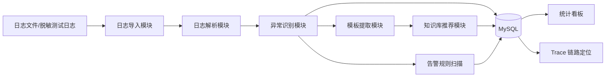

# 系统设计概要

## 业务背景

国际营销平台涉及优惠券、营销活动、积分、会员权益、订单赠券等业务链路。系统依赖外部订单、会员、消息、库存和优惠券发放服务，测试和运维过程中常见异常日志分散、重复问题定位慢、排错经验难沉淀等问题。

## 总体架构

## 核心模块

- 部署单元管理模块：维护国际营销平台测试环境中的应用编码、部署单元名称、单元类型和环境信息，为日志任务、异常事件和看板统计提供归属维度。
- 日志导入与任务管理模块：负责文件上传、任务创建、文件落盘、分析状态记录，并沉淀日志行数、异常数、分析耗时等指标。
- 日志解析模块：从原始日志中抽取时间、级别、线程、类名、traceId、接口和消息。
- 异常识别模块：识别 ERROR 日志、Exception、timeout、SQL、RPC、Kafka、Job 等异常，并记录分类分数与命中关键词，为异常定位提供可解释依据。
- Trace 链路定位模块：基于 traceId 聚合同一次请求的上下文日志，按时间顺序展示链路，并标记首个异常日志作为疑似根因。
- 模板提取模块：将手机号、订单号、ID、时间、UUID 等变量替换为占位符，形成异常模板。
- 知识库推荐模块：基于关键词和 Jaccard 相似度推荐处理方案，并支持人工反馈推荐是否有效。
- 告警规则模块：基于部署单元、异常类型、接口和阈值配置告警规则，在日志分析完成后扫描异常事件并生成告警。
- 看板模块：统计错误趋势、异常类型分布、TOP 接口和 TOP 异常模板。

## 当前部署单元范围

系统以国际营销平台测试环境的工程资产为日志归属对象，首批内置 IBU-IMP-CORE 与 IBU-IMP-CORE-OS 下的 manage、service、admin-web、imp-backend、imp-backend-os、web-h5、activity-h5、imp-promotion、imp-wechat、imp-proxy、activity 等单元。论文中负责人信息按脱敏标识呈现。

## 异常事件增强

异常事件支持按部署单元和异常类型筛选。详情中展示异常摘要、traceId、接口、异常模板、异常栈、知识库推荐结果、分类命中关键词和分类分数，形成“发现异常-查看依据-定位原因”的最小闭环。

## 分析任务管理

系统将每次日志上传抽象为一个分析任务，记录部署单元、日志类型、任务状态、日志总行数、异常数量、开始时间、结束时间和处理耗时。前端支持查看任务历史，并可从任务列表直接筛选该批次产生的异常事件。该模块为论文功能测试和性能测试提供基础数据。

## Trace 链路定位

系统提供按 traceId 查询链路日志的能力。查询时从结构化日志表中筛选同一 traceId 的记录，按日志时间和行号排序，并统计日志总数、异常日志数、首尾时间。系统将链路中的首条 ERROR、Exception 或 failed 日志标记为疑似根因，生成根因摘要，辅助测试人员从异常事件快速回溯到请求上下文。

## 告警规则设计

告警规则支持按部署单元、异常类型、接口、时间窗口和阈值进行配置。当前 MVP 在每次日志分析任务完成后触发规则扫描，对该批次产生的异常事件进行统计；当异常数量达到阈值时生成 OPEN 状态的告警事件。告警事件支持人工关闭，形成“规则配置-异常扫描-告警生成-状态处理”的监控闭环。

## 知识库闭环

系统支持维护异常知识库，包括异常类型、关键词、原因说明、处理方案和启停状态。异常详情中可对推荐结果进行“有效”或“无效”反馈，反馈记录用于衡量知识库推荐效果，也为后续补充未命中或低质量推荐提供依据。该模块形成“异常识别-方案推荐-人工反馈-知识沉淀”的闭环。
